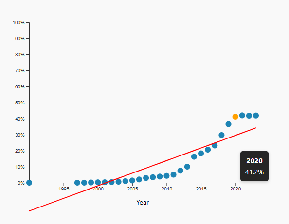

# 🌐 Cameroon Internet Penetration (1990–2023)

An interactive and responsive **scatter plot** built with **D3.js** to visualize **Internet penetration in Cameroon** over time.  
This project demonstrates trends in technology adoption and digital connectivity using **real-world data** from the **World Bank API**.

---

## 🚀 Demo
Live Demo: [Your Live Link Here](https://your-live-demo-link.com)

---

## 🖥️ Features
- Interactive scatter plot displaying **Internet users (%)** by year  
- Fully **responsive design** for all screen sizes  
- **Hover tooltips** show exact year and Internet penetration percentage  
- Optional **trend line** visualizes adoption growth  
- Uses **real-world data** from the World Bank API  

---

## 📂 Project Structure
```bash
├── index.html
├── style.css
├── script.js
└── README.md
```

---

## 🛠️ Technologies Used
- **HTML5** – Structure  
- **CSS3** – Styling and responsiveness  
- **JavaScript (ES6)** – Logic  
- **[D3.js v7](https://d3js.org/)** – Data visualization library  
- **Fetch API** – To load Internet penetration data from World Bank API  

---

## 📊 Data Source
The dataset comes from the **[World Bank](https://data.worldbank.org/indicator/IT.NET.USER.ZS?locations=CM)** and provides **Internet users (% of population) in Cameroon** from 1990 to 2023.

---

## 📱 Responsive Design
- Chart automatically scales to fit different screen sizes  
- Minimum chart width is enforced for readability  
- Hover tooltips dynamically follow the cursor  

---

## 🎨 Screenshots


---

## 📜 License
This project is open-source and available under the **MIT License**.

---

## 🙌 Acknowledgements
- [World Bank](https://data.worldbank.org/) – for the data  
- [D3.js](https://d3js.org/) – for visualization tools  

---

## 👤 Author
**Landoh Clansy**
